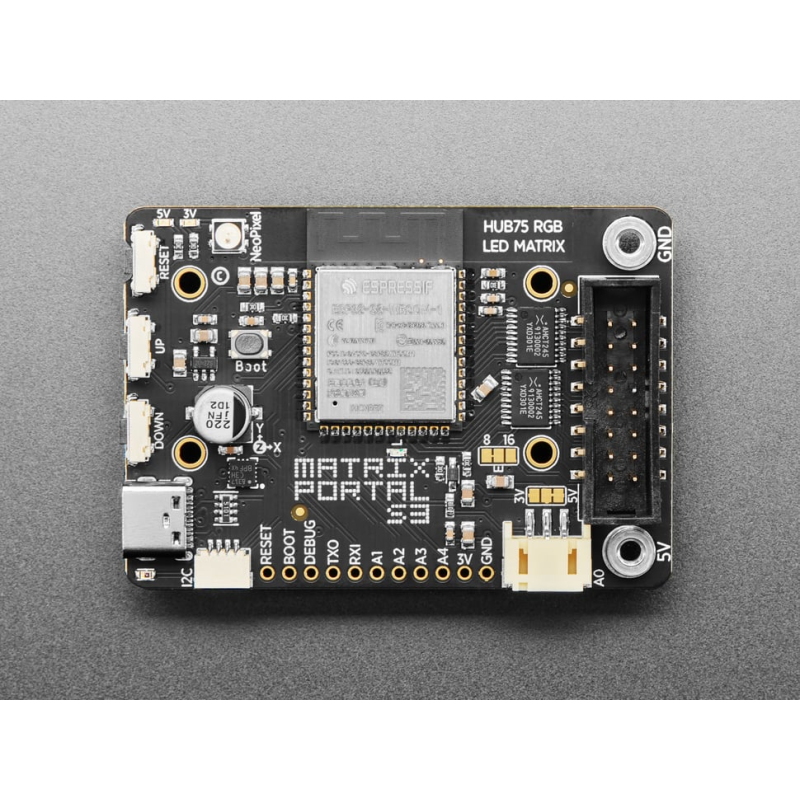
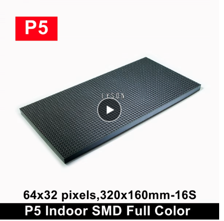
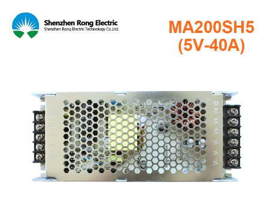
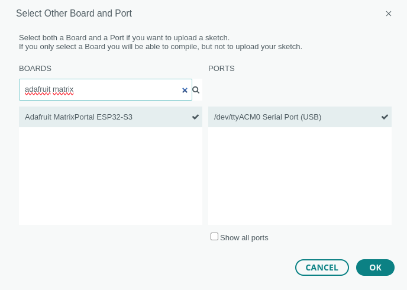
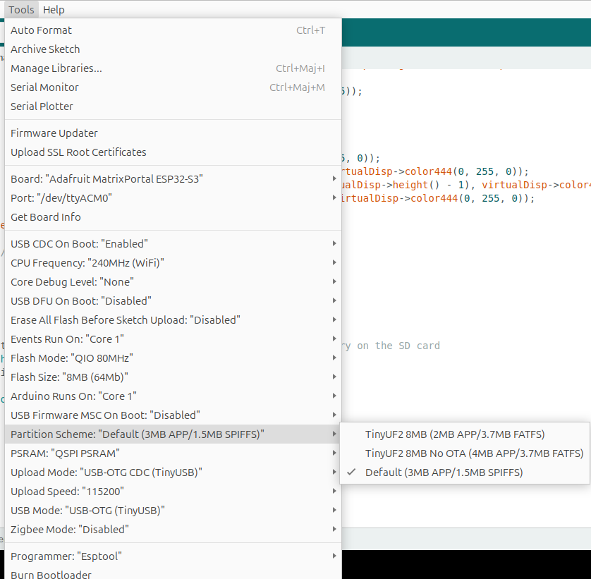
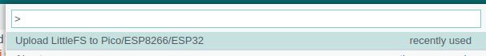

# LED matrix 192x64

## Context

For a running event I am organizing, [La 147](https://la147.run), I need a sufficiently large LED matrix to make the welcome area visible from a distance. I have decided to use a chain of LED panels measuring 320mm x 160mm


The frame :


## Hardware

### List

| Item                         | Photo                                                 | Description |
| ---------------------------- | ----------------------------------------------------- | ----------- |
| Adafruit matrix portal s3    |  | An ESP32 controller with direct connexion to led panel |
| 6 Led panels 64x32 p5        |              | [Led panels](https://fr.aliexpress.com/item/1005006609961440.html?spm=a2g0o.order_list.order_list_main.5.34765e5b7eZUdO&gatewayAdapt=glo2fra) |
| Power Unit 5V 40A            |                              | [Power](https://fr.aliexpress.com/item/33023098714.html?spm=a2g0o.order_list.order_list_main.10.27ff5e5bdnBtsF&gatewayAdapt=glo2fra) |

### Mounting options

I've decided to use some 3d pieces found here ! https://www.thingiverse.com/thing:3930129

## Software

### IDE and librairies

In general, I use the Arduino IDE (version 2.3.3). The type of board to select is as follows :



To manage the entire LED frame, I use the excellent library [ESP32-HUB75-MatrixPanel-DMA](https://github.com/mrcodetastic/ESP32-HUB75-MatrixPanel-DMA/)  
and specifically this example: https://github.com/mrcodetastic/ESP32-HUB75-MatrixPanel-DMA/tree/master/examples/VirtualMatrixPanel.

It allows you to create a virtual frame with a chain of LED panels:"


I choosed the mode `CHAIN_TOP_RIGHT_DOWN`.

### Specifications Adafruit Portal Matrix S3

Since I am using an Adafruit Portal Matrix S3 board, the pins need to be adapted.

```cpp
#define R1_PIN 42
#define G1_PIN 41
#define B1_PIN 40
#define R2_PIN 38
#define G2_PIN 39
#define B2_PIN 37
#define A_PIN 45
#define B_PIN 36
#define C_PIN 48
#define D_PIN 35
#define E_PIN 21
#define LAT_PIN 47
#define OE_PIN 14
#define CLK_PIN 2

HUB75_I2S_CFG::i2s_pins _pins = { R1_PIN, G1_PIN, B1_PIN, R2_PIN, G2_PIN, B2_PIN, A_PIN, B_PIN, C_PIN, D_PIN, E_PIN, LAT_PIN, OE_PIN, CLK_PIN };
```

And pass them to the constructor

```
   HUB75_I2S_CFG mxconfig(
      PANEL_RES_X,  // module width
      PANEL_RES_Y,  // module height
      PANEL_CHAIN,  // chain length
      _pins);
```

And to avoid a shift on certain panels, I use this option :

```cpp
mxconfig.clkphase = false;
```

### Some tests to validate the frame

If one of these test does not provide any correct result, try to find what happens before continuing.

**Basic structure**

```cpp
void setup() {

  Serial.begin(115200);
  Serial.println("");
  Serial.println("");
  Serial.println("");
  Serial.println("*****************************************************");
  Serial.println(" HELLO !");
  Serial.println("*****************************************************");


  /******************************************************************************
   * Create physical DMA panel class AND virtual (chained) display class.   
   ******************************************************************************/

  /*
    The configuration for MatrixPanel_I2S_DMA object is held in HUB75_I2S_CFG structure,
    All options has it's predefined default values. So we can create a new structure and redefine only the options we need

	Please refer to the '2_PatternPlasma.ino' example for detailed example of how to use the MatrixPanel_I2S_DMA configuration
  */

    HUB75_I2S_CFG mxconfig(
      PANEL_RES_X,  // module width
      PANEL_RES_Y,  // module height
      PANEL_CHAIN,  // chain length
      _pins);

  mxconfig.clkphase = false;
  //mxconfig.driver = HUB75_I2S_CFG::FM6126A;     // in case that we use panels based on FM6126A chip, we can set it here before creating MatrixPanel_I2S_DMA object

  // Sanity checks
  if (NUM_ROWS <= 1) {
    Serial.println(F("There is no reason to use the VirtualDisplay class for a single horizontal chain and row!"));
  }

  // OK, now we can create our matrix object
  dma_display = new MatrixPanel_I2S_DMA(mxconfig);

  // let's adjust default brightness to about 75%
  dma_display->setBrightness8(192);  // range is 0-255, 0 - 0%, 255 - 100%

  // Allocate memory and start DMA display
  if (not dma_display->begin())
    Serial.println("****** !KABOOM! I2S memory allocation failed ***********");

  // create VirtualDisplay object based on our newly created dma_display object
  virtualDisp = new VirtualMatrixPanel((*dma_display), NUM_ROWS, NUM_COLS, PANEL_RES_X, PANEL_RES_Y, VIRTUAL_MATRIX_CHAIN_TYPE);
```

**The general test provided with the example**

```cp
  // So far so good, so continue
  virtualDisp->fillScreen(virtualDisp->color444(0, 0, 0));
  virtualDisp->drawDisplayTest();  // draw text numbering on each screen to check connectivity

  // delay(1000);

  Serial.println("Chain of 4x 64x32 panels for this example:");
  Serial.println("+---------+---------+");
  Serial.println("|    4    |    3    |");
  Serial.println("|         |         |");
  Serial.println("+---------+---------+");
  Serial.println("|    1    |    2    |");
  Serial.println("| (ESP32) |         |");
  Serial.println("+---------+---------+");

  // draw blue text
  virtualDisp->setFont(&FreeSansBold12pt7b);
  virtualDisp->setTextColor(virtualDisp->color565(0, 0, 255));
  virtualDisp->setTextSize(3);
  virtualDisp->setCursor(0, virtualDisp->height() - ((virtualDisp->height() - 45) / 2));
  virtualDisp->print("ABCD");

  // Red text inside red rect (2 pix in from edge)
  virtualDisp->drawRect(1, 1, virtualDisp->width() - 2, virtualDisp->height() - 2, virtualDisp->color565(255, 0, 0));

  // White line from top left to bottom right
  virtualDisp->drawLine(0, 0, virtualDisp->width() - 1, virtualDisp->height() - 1, virtualDisp->color565(255, 255, 255));

  virtualDisp->drawDisplayTest();  // re draw text numbering on each screen to check connectivity
```

**Turn on the frame of the virtual matrix**

```cpp
  virtualDisp->fillScreen(virtualDisp->color444(0, 0, 0));
  virtualDisp->drawRect(1, 1, virtualDisp->width() - 2, virtualDisp->height() - 2, virtualDisp->color565(255, 0, 0));
  virtualDisp->drawRect(0, 0, virtualDisp->width(), virtualDisp->height(), virtualDisp->color565(0, 255, 0));
  virtualDisp->setFont(&FreeSerifBold12pt7b);
  virtualDisp->setTextColor(virtualDisp->color565(0, 0, 255));
```

**Turn on 4 corner pixels of the frame**

```cpp
  virtualDisp->fillScreen(virtualDisp->color444(0, 0, 0));
  virtualDisp->drawPixel(0, 0, virtualDisp->color444(0, 255, 0));
  virtualDisp->drawPixel((virtualDisp->width() - 1), 0, virtualDisp->color444(0, 255, 0));
  virtualDisp->drawPixel((virtualDisp->width() - 1), (virtualDisp->height() - 1), virtualDisp->color444(0, 255, 0));
  virtualDisp->drawPixel(0, (virtualDisp->height() - 1), virtualDisp->color444(0, 255, 0));
```

### Displaying an animated gif

To announce the welcome area, I use an animated GIF of 192x64 pixels. I based it on the example provided here: https://github.com/mrcodetastic/ESP32-HUB75-MatrixPanel-DMA/tree/master/examples/AnimatedGIFPanel_LittleFS, which I adapted to the virtual frame.

I didn't do much; I 'just' replaced dma_display with virtualDisp.

The principle is quite simple: we create a filesystem of type LittleFS in which we include the GIFs and upload it to the controller."

#### Manage littleFS on arduino IDE

I installed the plugin `esp32fs` reading the doc here https://github.com/lorol/arduino-esp32fs-plugin

The only thing that did not work like expected is that the IDE can't `upload sketch data`. The button does not appear on IDE > 1.8.  
A perform it, I had to install an extension : https://github.com/earlephilhower/arduino-littlefs-upload

Once everthing is OK on the IDE, you'll have to create a data directory in the sketch root directory.  
Here is mine :

```
$ tree
.
├── data
│   └── gifs
│       └── la147-course-enfants.gif
├── la147_led_matrix_4panels_littlefs.ino
└── partition.csv
```

On the IDE, select a partition schema containing a SPIFFS FS.



Now you're ready to build the FS and upload it to the ESP32.

Press Ctrl-Shift-P and type `Upload LittleFS to ...`



It will 

* Build the littleFS FS

```
Building LittleFS filesystem
Command Line: /home/mika/.arduino15/packages/esp32/tools/mklittlefs/3.0.0-gnu12-dc7f933/mklittlefs -c /home/mika/Arduino/la147_led_matrix_4panels_littlefs/data -p 256 -b 4096 -s 1572864 /tmp/tmp-11393-7bC17MRqWqE3-.littlefs.bin
/gifs/la147-course-enfants.gif
```

* Upload it to the ESP32

```
Uploading LittleFS filesystem
Command Line: python3 /home/mika/.arduino15/packages/esp32/tools/esptool_py/4.6/esptool.py --chip esp32s3 --port /dev/ttyACM0 --baud 115200 --before default_reset --after hard_reset write_flash -z --flash_mode dio --flash_freq 80m --flash_size detect 6750208 /tmp/tmp-11393-LrXlFoEOzgZe-.littlefs.bin
esptool.py v4.6
Serial port /dev/ttyACM0
Connecting...
Chip is ESP32-S3 (revision v0.2)
Features: WiFi, BLE
Crystal is 40MHz
MAC: 74:4d:bd:2a:1a:54
Uploading stub...
Running stub...
Stub running...
Configuring flash size...
Auto-detected Flash size: 8MB
Flash will be erased from 0x00670000 to 0x007effff...
Compressed 1572864 bytes to 95921...
Writing at 0x00670000... (16 %)
Writing at 0x0070b466... (33 %)
Writing at 0x0071040c... (50 %)
Writing at 0x00714fe6... (66 %)
Writing at 0x00719e01... (83 %)
Writing at 0x0071ee95... (100 %)
Wrote 1572864 bytes (95921 compressed) at 0x00670000 in 4.9 seconds (effective 2542.6 kbit/s)...
Hash of data verified.

Leaving...
Hard resetting via RTS pin...

Completed upload.
```

If it does not work as expected, for example with the following error : "A fatal error occurred: Could not open /dev/ttyACM0, the port doesn't exist", try again things like :

  * Close Serial Monitor
  * Change board to any other and select Matrix portal again
  * Unplug USB and plug it again
  * Hold "boot" button and plus usb cable and then try again


